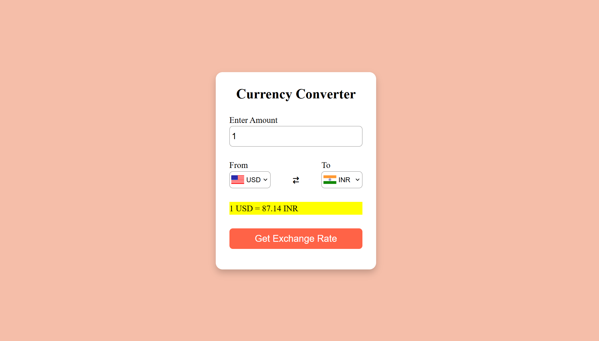

# Currency Converter 💱

A simple web-based currency converter that allows users to convert between different currencies using real-time exchange rates.




## Features

- **Real-time Exchange Rates** Fetches the latest exchange rates from the [ExchangeRate-API](https://www.exchangerate-api.com/).
- **User-friendly Interface**: Intuitive design with dropdowns for selecting currencies and an input field for entering the amount.
- **Flag Icons**: Displays country flags corresponding to the selected currencies.
- **Swap Functionality**: Allows users to swap the "from" and "to" currencies with a single click.


## ⚙️ Technologies Used

- **Frontend**: HTML, CSS, JavaScript
- **Backend**: Node.js, Express.js
- **API**: [ExchangeRate-API](https://www.exchangerate-api.com/)


## 🛠️ Setup Instructions

### Prerequisites

- Node.js and npm installed on your machine.
- An API key from [ExchangeRate-API](https://www.exchangerate-api.com/).

### Installation

1. **Clone the repository**
   ```bash
   git clone https://github.com/abhisheksinhagithub/Currency-Converter.git

2. **Navigate to the project directory**
   ```bash
   cd Currency-Converter

3. **Install dependencies**

   ```bash
   npm install
   ```

4. **Create a ```.env``` file in the root directory and add your API key:**:
    ```bash
    API_KEY=your_api_key_here
     ```

5. **Start the server**
   ```bash
    node server.js
     ```
6. **Open the application in your browser**
    ```bash
    http://localhost:3000
    ```

## Usage
1. Enter the amount you want to convert.
2. Select the "From" and "To" currencies from the dropdown menus.
3. Click the "Get Exchange Rate" button to see the converted amount.
4. Use the swap icon to switch between the "From" and "To" currencies.


## 🏗️ File Structure
```
Currency-Converter/
│
├── node_modules/        # Node.js dependencies (auto-generated)
├── public/              # Static files served by Express
│   ├── Image/           # Folder containing images
│   │   └── Logo.svg     # Project logo
│   ├── index.html       # Main HTML file for the currency converter
│   ├── style.css        # CSS file for styling the application
│   ├── script.js        # JavaScript logic for handling currency conversion
│   └── codes.js         # Currency codes and country codes mapping
├── server.js            # Backend server using Express.js
├── package.json         # Project dependencies and scripts
├── package-lock.json    # Lock file for dependencies
├── .gitignore           # Files to be ignored in version control
├── .env                 # Environment variables (e.g., API keys)
├── LICENSE              # License information for the project
└── README.md            # Project documentation
```


## API Key

To use this application, you need to obtain an API key from [ExchangeRate-API](https://www.exchangerate-api.com/). Once you have the key, add it to the ```.env``` file as shown in the setup instructions.


## Contributing

Contributions are welcome! If you find any issues or have suggestions for improvements, feel free to open an issue or submit a pull request.

## 📜 License

This project is licensed under the MIT License. See the [LICENSE](LICENSE) file for details.


## Acknowledgments

- [ExchangeRate-API](https://www.exchangerate-api.com/) for providing the currency exchange data.
- [Font Awesome](https://fontawesome.com/) for the icons used in the project.
- [FlagsAPI](https://flagsapi.com/) for the country flag images.


## Contact

For any questions or feedback, feel free to reach out:

- Your Name: Your Email Address
- GitHub: your-username